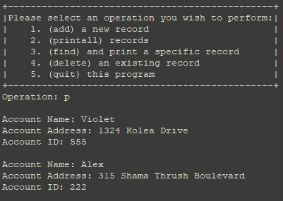
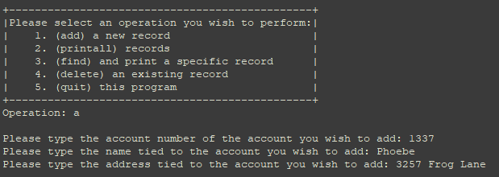
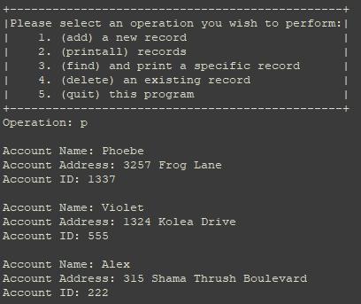
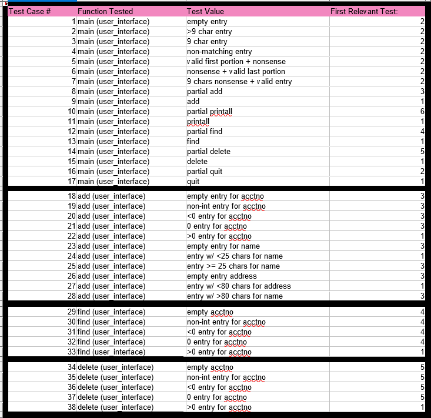
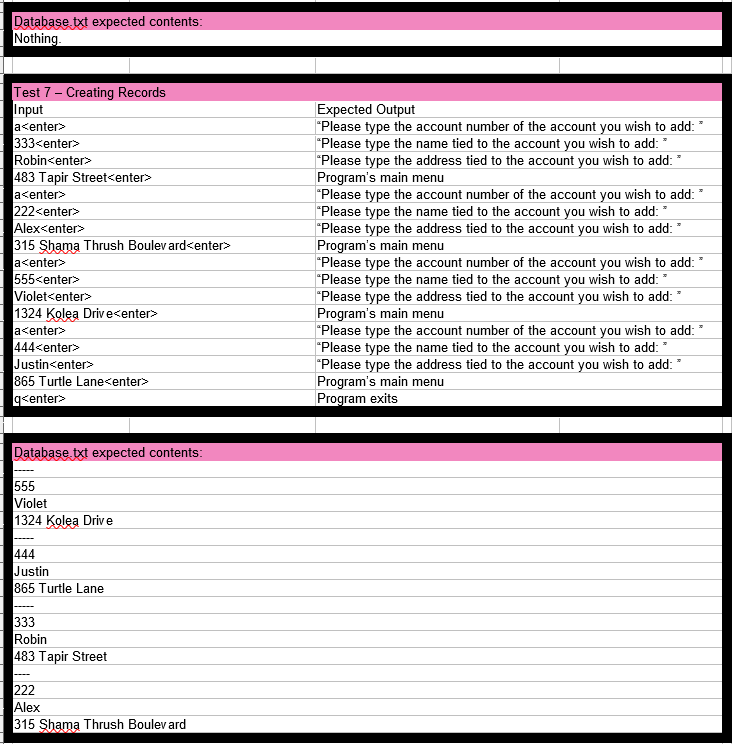

The Bank(TM) Account Database is a small C project which stores, retrieves, and modifies bank accounts stored in a txt file.
As it was an individual project for a lower level class, the program isn't absurdly complex, and each account comprises only an account ID, a name, and an address.
Upon launching the program, the accounts are read in from the txt file and written into a linked list.
Then, the program enters it's central loop, where it presents users with the option to add a record, print all records, print a record specified by account ID, delete a record, or quit.
Upon selecting an option, the user is able to complete that action, after which they are returned to the central menu.
This cycle continues indefinitely until they select the quit option.
Upon selecting the quit option, the program overwrites the txt file and exits.

Here are some examples of the program in action!

Printing all the records in the database

Adding a record to the database

Printing all the records in the database, including the newly added one.

As this was a solo project, all the work was done by me.
The scope of the project was not large, however its size belies its difficulty due to it being written in C.
Much as I enjoy working on the lower level of C and C++, it is decidedly more difficult to work on any kind of a grander scale with them.
Furthermore, although I greatly enjoy working with pointers, this was especially true due to the accounts being stored in a linkedlist and as such requiring the use of them.
This project helped me develop my skills with both C and working more generally on a lower level, but the most novel concept I worked with was a test plan such that you know exactly where and when everything happens.
This was my first time working with a language on a lower level like C, so I previously had been used to there being a medley of things that were "just the way it worked," even when creating tests.
However, for this project I had to create a test plan in a spread sheet defining all the edge cases I could conceive of along with what should be in the database after every individual test.
It was really interesting effectively working as a human version of TestCafe, jUnit, or other such unit test packages.
Perhaps not so much in the actual execution, but I found it quite interesting to effectively "program" myself in the same way as a unit testing library by defining a bunch of tests in a strict format and executing each test step by step.
As an example, here are some examples of the test cases which I designed tests to cover,

And here is an example of one of the tests I devised to cover as many test cases as possible with as few tests as possible.

Overall, while I'm not sure how much I'm going to be working with C in the future, I enjoyed working on this project and I felt like it really furthered my understanding of the language.
If you're intersted in checking out this project, the repository for it can be found [here](https://github.com/Somewha7/bank-TM-Database-ICS-235-). 
It contains the uncompiled files, the makefile, and the test plan (testplan.xlsx).
In order to run it, simply use the make command in the directory, and then run ./project.
