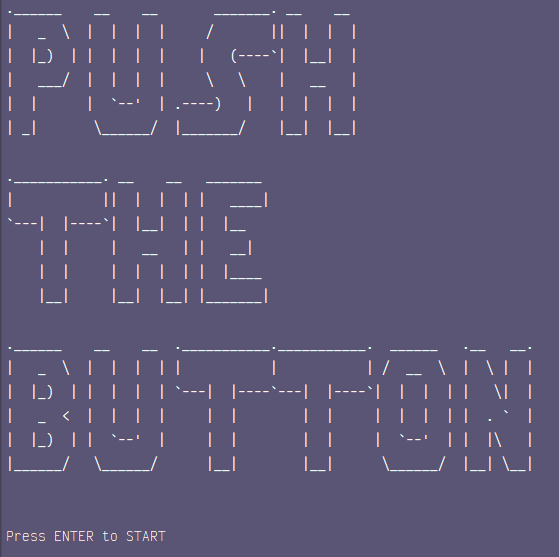
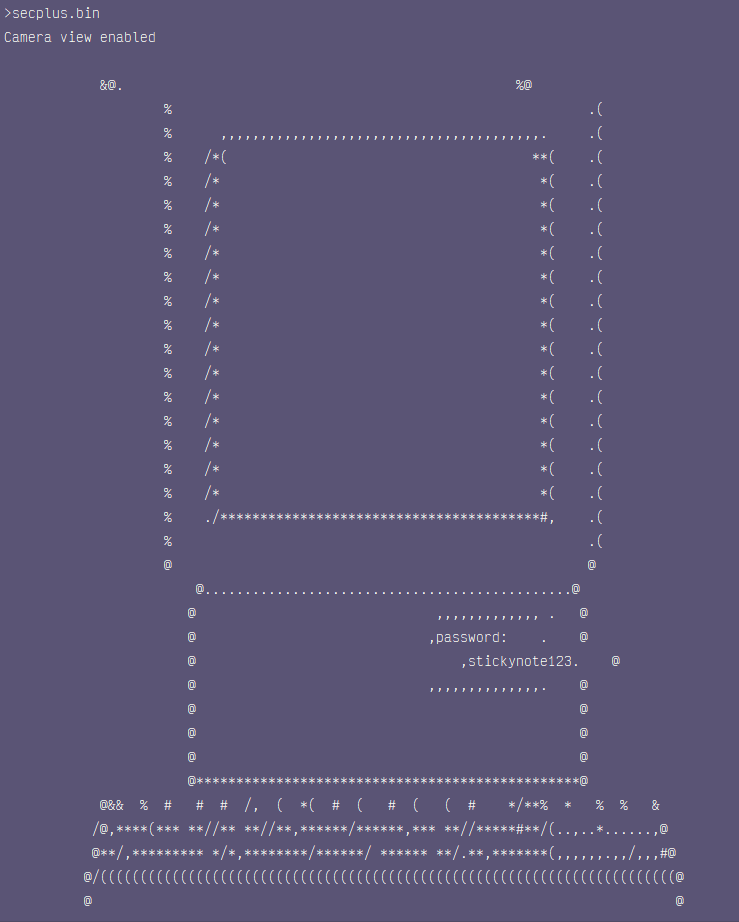
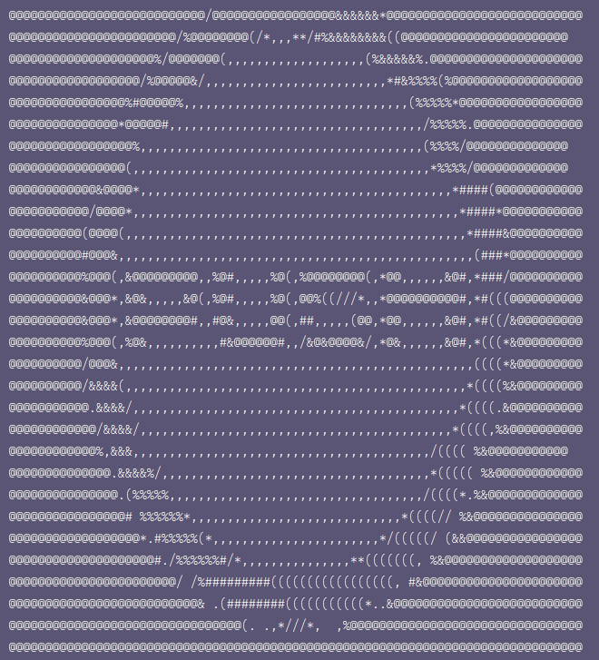
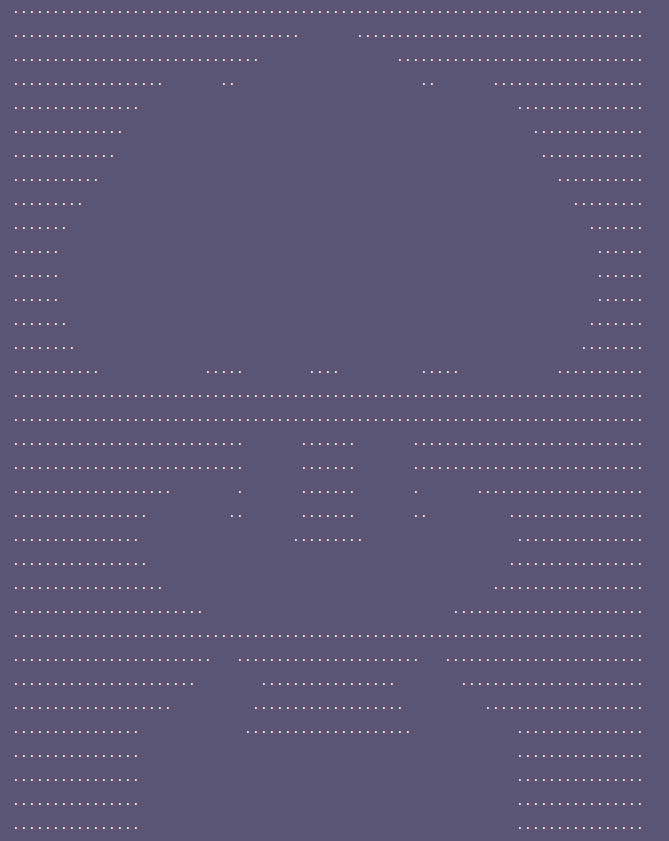

Push the Button is a text game which runs in the terminal, satirizing the missle scare that occured in Hawaii in 2018. 
It's split into 4 different levels, and you progress through the various levels by poking around to discover various passwords and logging in to new accounts.
Ultimately, you're presented with a button. 
Whether to push it or not is left up to you.

Here's a couple of images of the game!

The starting screen of the game.

One of the passwords, written on a sticky note attached to a PC.

The titular button!

Whoops! Maybe you shouldn't have pushed the button after all...

Push the Button was designed over the course of 2 days for the Honolulu Global Game Jam of 2018, a short and sweet jam where you make a small game over the course of one weekend.
I mostly helped with the creation of level 1, in which the player uses simplified versions of several terminal commands to traverse a fake desktop and find a password to use to progress to the next level.
At the time of building this little game, I was a rank beginner at coding in general, so this project was my first real introduction to working with code that functioned over multiple files.

The repository for Push the Button can be found [here](https://github.com/CarrotShaver/pushthebutton).
