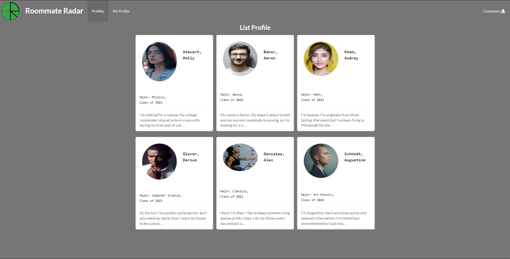

  

Roommate Radar is a website deisgned to help current UH Manoa students find others to live with off campus.
Users are able to look through the list of every other account on the site, filter to their preferences, and acquire other users' socials to message them with.

I wrote much of the GitHub page detailing the project, did a significant amount of work developing the site itself, and contributed towards the planning and issue creation for each milestone.
With regards to the site itself, I most of the a lot of back end work, and helped with some of the front end work.
On the back end, I set up the MongoDB collections, defined default data that was used for much of the project, deployed the website, set up https and the domain name, and implemented tests and continuous integration.
On the front end, I didn't create much from scratch, but I helped refine the pages that others made -- especially the forms and the user profile page.

Here's a couple examples of pages from the Roommate Radar site:

The List Profiles page, where users see profiles displayed to them.

The User Profile page, where more detailed information about a single user can be viewed.

In working on this project, I learned a lot about working with others on a website, how to define issues in ways that are easiest for the people who work on them to understand, and how to work with the back end of websites.
We had learned about working with the back end prior to starting this project, but working on it without having a set of instructions to refer to was very helpful for furthering my understanding.

More details can be found at [here](https://roommate-radar.github.io) at its github page, and the site can be found [here](https://roommate-radar.com) for as long as it remains running on Digital Ocean.
If the site is no longer being maintained, a local version of it may be ran using the steps in the Developer Guide portion of the github page
